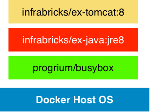
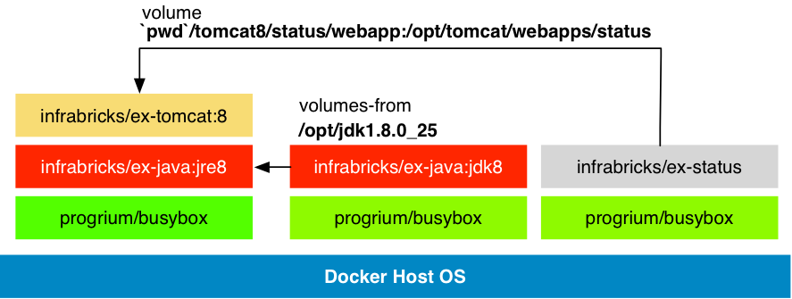
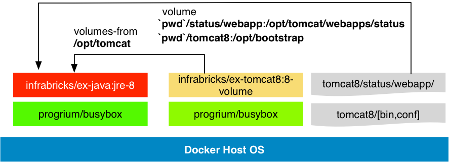

# This is a simple tomcat docker image setup

 * Based on busybox
 * Use a very small footprint
 * Install Apache Tomcat 8 basic distribution
 * Samples and Tricks
   * Composition
   * Overlay JRE with JDK
   * Overwrite or extend Tomcat configs, webapps or libs



It is the sample from my german [blog post](http://www.infrabricks.de)

## Build

Create the images with `./build.sh`

    $ ./build.sh
    $ docker images | grep "infrabricks/ex-"
    infrabricks/ex-status                                      latest              1c267a744c50        18 seconds ago       4.82 MB
    infrabricks/ex-java                                        jdk-8               6a16ac13d19f        5 minutes ago        331.3 MB
    infrabricks/ex-tomcat                                      8-volume            8b11401ffa83        12 minutes ago       15.49 MB
    infrabricks/ex-tomcat                                      8                   aa91560e2d92        15 minutes ago       171 MB
    infrabricks/ex-java                                        jre-8               ff8342ad2463        41 minutes ago       160.3 MB

You see that the java images sizes are very small!

## Use the images

Information about the installed tomcat version:

```bash
$ docker run --rm --entrypoint=/opt/tomcat/bin/version.sh infrabricks/ex-tomcat:8
Server version: Apache Tomcat/8.0.15
Server built:   Nov 2 2014 19:25:20 UTC
Server number:  8.0.15.0
OS Name:        Linux
OS Version:     3.16.7-tinycore64
Architecture:   amd64
JVM Version:    1.8.0_25-b17
JVM Vendor:     Oracle Corporation
heisenberg:docker-simple-tomcat8 peter$
```

### Start a tomcat with example app

```bash
$ mkdir -p webapps/status
$ cd status/webapp
$ vi index.jsp
...
$ zip -r ../status.war .
$ cd ..
$ CID=$(docker run -d -p 8002:8080 -v `pwd`/status/webapp:/opt/tomcat/webapps/status infrabricks/ex-tomcat:8)
$ docker logs $CID
18-Dec-2014 16:39:20.610 INFO [main] org.apache.catalina.startup.VersionLoggerListener.log Server version:        Apache Tomcat/8.0.15
18-Dec-2014 16:39:20.612 INFO [main] org.apache.catalina.startup.VersionLoggerListener.log Server built:          Nov 2 2014 19:25:20 UTC
18-Dec-2014 16:39:20.612 INFO [main] org.apache.catalina.startup.VersionLoggerListener.log Server number:         8.0.15.0
18-Dec-2014 16:39:20.612 INFO [main] org.apache.catalina.startup.VersionLoggerListener.log OS Name:               Linux
18-Dec-2014 16:39:20.612 INFO [main] org.apache.catalina.startup.VersionLoggerListener.log OS Version:            3.16.7-tinycore64
18-Dec-2014 16:39:20.612 INFO [main] org.apache.catalina.startup.VersionLoggerListener.log Architecture:          amd64
18-Dec-2014 16:39:20.612 INFO [main] org.apache.catalina.startup.VersionLoggerListener.log JAVA_HOME:             /opt/jdk1.8.0_25/jre
18-Dec-2014 16:39:20.612 INFO [main] org.apache.catalina.startup.VersionLoggerListener.log JVM Version:           1.8.0_25-b17
18-Dec-2014 16:39:20.612 INFO [main] org.apache.catalina.startup.VersionLoggerListener.log JVM Vendor:            Oracle Corporation
18-Dec-2014 16:39:20.612 INFO [main] org.apache.catalina.startup.VersionLoggerListener.log CATALINA_BASE:         /opt/tomcat
18-Dec-2014 16:39:20.612 INFO [main] org.apache.catalina.startup.VersionLoggerListener.log CATALINA_HOME:         /opt/tomcat
18-Dec-2014 16:39:20.613 INFO [main] org.apache.catalina.startup.VersionLoggerListener.log Command line argument: -Djava.util.logging.config.file=/opt/tomcat/conf/logging.properties
18-Dec-2014 16:39:20.613 INFO [main] org.apache.catalina.startup.VersionLoggerListener.log Command line argument: -Djava.util.logging.manager=org.apache.juli.ClassLoaderLogManager
18-Dec-2014 16:39:20.613 INFO [main] org.apache.catalina.startup.VersionLoggerListener.log Command line argument: -Djava.endorsed.dirs=/opt/tomcat/endorsed
18-Dec-2014 16:39:20.613 INFO [main] org.apache.catalina.startup.VersionLoggerListener.log Command line argument: -Dcatalina.base=/opt/tomcat
18-Dec-2014 16:39:20.613 INFO [main] org.apache.catalina.startup.VersionLoggerListener.log Command line argument: -Dcatalina.home=/opt/tomcat
18-Dec-2014 16:39:20.613 INFO [main] org.apache.catalina.startup.VersionLoggerListener.log Command line argument: -Djava.io.tmpdir=/opt/tomcat/temp
18-Dec-2014 16:39:20.613 INFO [main] org.apache.catalina.core.AprLifecycleListener.lifecycleEvent The APR based Apache Tomcat Native library which allows optimal performance in production environments was not found on the java.library.path: /usr/java/packages/lib/amd64:/usr/lib64:/lib64:/lib:/usr/lib
18-Dec-2014 16:39:20.789 INFO [main] org.apache.coyote.AbstractProtocol.init Initializing ProtocolHandler ["http-nio-8080"]
18-Dec-2014 16:39:20.811 INFO [main] org.apache.tomcat.util.net.NioSelectorPool.getSharedSelector Using a shared selector for servlet write/read
18-Dec-2014 16:39:20.815 INFO [main] org.apache.coyote.AbstractProtocol.init Initializing ProtocolHandler ["ajp-nio-8009"]
18-Dec-2014 16:39:20.817 INFO [main] org.apache.tomcat.util.net.NioSelectorPool.getSharedSelector Using a shared selector for servlet write/read
18-Dec-2014 16:39:20.819 INFO [main] org.apache.catalina.startup.Catalina.load Initialization processed in 702 ms
18-Dec-2014 16:39:20.847 INFO [main] org.apache.catalina.core.StandardService.startInternal Starting service Catalina
18-Dec-2014 16:39:20.847 INFO [main] org.apache.catalina.core.StandardEngine.startInternal Starting Servlet Engine: Apache Tomcat/8.0.15
18-Dec-2014 16:39:20.863 INFO [localhost-startStop-1] org.apache.catalina.startup.HostConfig.deployDirectory Deploying web application directory /opt/tomcat/webapps/status.war
18-Dec-2014 16:39:21.584 INFO [localhost-startStop-1] org.apache.catalina.startup.HostConfig.deployDirectory Deployment of web application directory /opt/tomcat/webapps/status.war has finished in 720 ms
18-Dec-2014 16:39:21.585 INFO [localhost-startStop-1] org.apache.catalina.startup.HostConfig.deployDirectory Deploying web application directory /opt/tomcat/webapps/manager
18-Dec-2014 16:39:21.630 INFO [localhost-startStop-1] org.apache.catalina.startup.HostConfig.deployDirectory Deployment of web application directory /opt/tomcat/webapps/manager has finished in 44 ms
18-Dec-2014 16:39:21.636 INFO [main] org.apache.coyote.AbstractProtocol.start Starting ProtocolHandler ["http-nio-8080"]
18-Dec-2014 16:39:21.647 INFO [main] org.apache.coyote.AbstractProtocol.start Starting ProtocolHandler ["ajp-nio-8009"]
18-Dec-2014 16:39:21.649 INFO [main] org.apache.catalina.startup.Catalina.start Server startup in 829 ms
```

### Access an application locally

```
$ IP=$(docker inspect --format '{{ .NetworkSettings.IPAddress }}' ${CID})
$ echo $IP
172.17.0.71
$ curl -s http://$IP:8080/status/index.jsp


<html>
<body>
<h1>Docker Tomcat Status page</h1>

<ul>
<li>Hostname : 902079cacbc0</li>
<li>Tomcat Version : Apache Tomcat/8.0.15</li>
<li>Servlet Specification Version : 3.1</li>
<li>JSP version : 2.3</li>
<li>Now : 2014/12/18 16:45:25</li>
</ul>
</body>
</html
```

### Use JDK as overlay



```bash
$ docker run --name jdk8 infrabricks/ex-java:jdk-8
$ docker run -d -p 8002:8080 \
--volumes-from jdk8 \
-v `pwd`/status/webapp:/opt/tomcat/webapps/status \
infrabricks/ex-tomcat:8
$ CID=$(docker ps -lq)
$ docker exec $CID jps
1 Bootstrap
49 Jps
$ docker exec $CID jstat -gc 1 5000
S0C    S1C    S0U    S1U      EC       EU        OC         OU       MC     MU    CCSC   CCSU   YGC     YGCT    FGC    FGCT     GCT
1024.0 1024.0  0.0   992.0  17408.0  10440.2   22016.0     8928.4   13056.0 12628.3 1536.0 1391.4      3    0.037   0      0.000    0.037
1024.0 1024.0  0.0   992.0  17408.0  10440.2   22016.0     8928.4   13056.0 12628.3 1536.0 1391.4      3    0.037   0      0.000    0.037
CTRL-C
$ docker exec -ti $CID /bin/sh
...
```

Now debugging is really easy possible, but without building a new tomcat development image!

### Use the tomcat manager



**tomcat-users.xml**
```xml
<?xml version='1.0' encoding='utf-8'?>
<<tomcat-users xmlns="http://tomcat.apache.org/xml"
  xmlns:xsi="http://www.w3.org/2001/XMLSchema-instance"
  xsi:schemaLocation="http://tomcat.apache.org/xml tomcat-users.xsd"
  version="1.0">

  <role rolename="manager-script"/>
  <user username="manager" password="tomcat" roles="manager-script"/>
</tomcat-users>
```

```bash
$ docker run -d -p 8002:8080 \
 -v `pwd`/status/webapp:/opt/tomcat/webapps/status \
 -v `pwd`/tomcat8:/opt/bootstrap \
 --entrypoint=/opt/bootstrap/bin/tomcat.sh \
infrabricks/ex-tomcat:8
$ CID=$(docker ps -lq)
$ docker logs $CID
Checking *.war in /opt/bootstrap/webapps
Checking tomcat extended libs *.jar in /opt/bootstrap/lib
Checking tomcat conf files in /opt/bootstrap/conf
Linking /opt/bootstrap/conf/tomcat-users.xml --> /opt/tomcat/conf/tomcat-users.xml
18-Dec-2014 17:45:18.678 INFO [main] org.apache.catalina.startup.VersionLoggerListener.log Server version:        Apache Tomcat/8.0.15
18-Dec-2014 17:45:18.681 INFO [main] org.apache.catalina.startup.VersionLoggerListener.log Server built:          Nov 2 2014 19:25:20 UTC
18-Dec-2014 17:45:18.682 INFO [main] org.apache.catalina.startup.VersionLoggerListener.log Server number:         8.0.15.0
18-Dec-2014 17:45:18.683 INFO [main] org.apache.catalina.startup.VersionLoggerListener.log OS Name:               Linux
18-Dec-2014 17:45:18.683 INFO [main] org.apache.catalina.startup.VersionLoggerListener.log OS Version:            3.16.7-tinycore64
18-Dec-2014 17:45:18.687 INFO [main] org.apache.catalina.startup.VersionLoggerListener.log Architecture:          amd64
...
$ IP=$(docker inspect --format '{{ .NetworkSettings.IPAddress }}' ${CID})
$ curl -su manager:tomcat http://$IP:8080/manager/text/list
OK - Listed applications for virtual host localhost
/status:running:0:status
/manager:running:0:manager
```

### Install tcnative at debian

```
ENV DEBIAN_FRONTEND noninteractive
ENV LD_LIBRARY_PATH ${LD_LIBRARY_PATH}:/usr/lib/x86_64-linux-gnu/

RUN apt-get update
RUN apt-get install -y libtcnative-1
```

 - [Tomcat tcnative documentation](http://tomcat.apache.org/native-doc/)
 - install openssl and apr
 - Build newest version?


***

See my [infrabricks blog](http://www.infrabricks.de) to more informations.

Regards
Peter <peter.rossbach@bee42.com>

Follow me [at Twitter](https://twitter.com/PRossbach)

## Links

 - [Apache Tomcat](https://tomcat.apache.org)
 - [Docker](https://docker.com)
 - [Infrabricks Blog](http://www.infrabricks.de)
